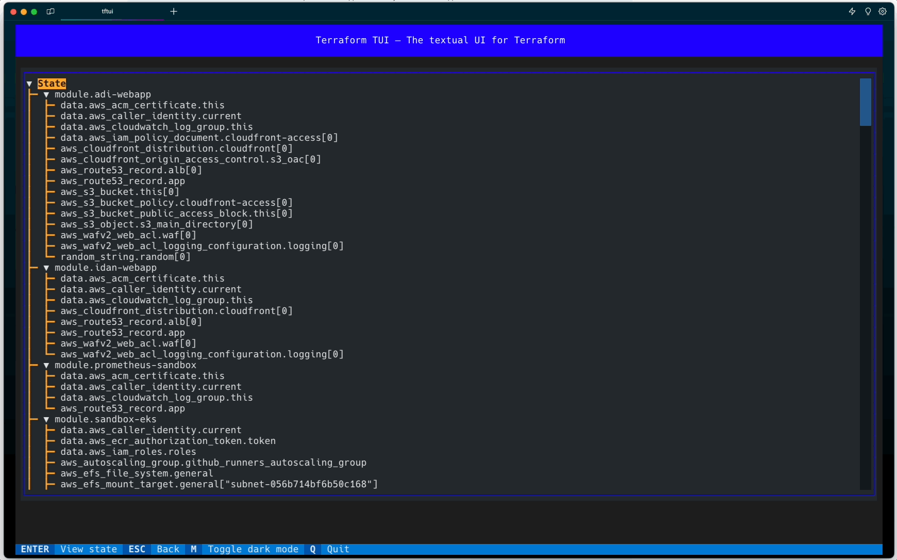

# TFTUI - The Terraform textual UI

`TFTUI` is a powerful textual GUI that empowers users to effortlessly view and interact with their Terraform state.

With its latest version you can easily visualize the complete state tree, gaining deeper insights into your infrastructure's current configuration. Additionally, the ability to inspect individual resource states allows you to focus on specific details for better analysis and management. Lastly, it's now possible to select resources and perform actions such as tainting and untainting.

## Key Features

### version 0.8

- [x] Added a delete resource option

### version 0.7

- [x] Added a search option (press `/` to search)
- [x] New styling for selected resources

### version 0.6

- [x] Added usage tracking with [PostHog](https://posthog.com)
- [x] Added new version notice

### version 0.5

- [x] Added support for terragrunt (and other Terraform wrappers); courtesy of [@jonwtech](https://github.com/jonwtech)

### version 0.4

- [x] Fixed the erroneous flattening of submodules
- [x] Added collapse levels for the state tree
- [x] Added command line options

### version 0.3

- [x] Added loading screen and status bar
- [x] Added selection of resources
- [x] Added refresh state functionality
- [x] Added taint/untaint functionality
- [x] Refactoring

### version 0.2

- [x] Comprehensive display of the entire Terraform state tree.
- [x] Effortlessly view and navigate through a single resource state.

## Demo

## Installation

| Tool     | Install                                | Upgrade                       | Run                                      |
| -------- | -------------------------------------- | ----------------------------- | ---------------------------------------- |
| Homebrew | `brew install idoavrah/homebrew/tftui` | `brew upgrade tftui`          | `cd /path/to/terraform/project && tftui` |
| PIP      | `pip install tftui`                    | `pip install --upgrade tftui` | `cd /path/to/terraform/project && tftui` |
| PIPX     | `pipx install tftui`                   | `pipx upgrade tftui`          | `cd /path/to/terraform/project && tftui` |

## Usage Tracking

* TFTUI utilizes [PostHog](https://posthog.com) to track usage of the application.
* This is done to help us understand how the tool is being used and to improve it.
* No personal data is being sent to the tracking service.
* You can opt-out of usage tracking completely by setting the `-d` flag when running the tool.

## Star History

