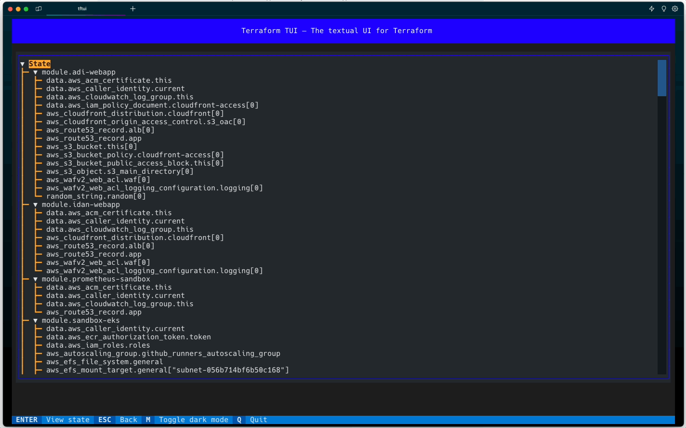

# TFTUI - The Terraform Textual UI

TFTUI is a powerful textual GUI that empowers users to effortlessly view and interact with their Terraform state.

With its latest version [0.2.0](https://github.com/idoavrah/terraform-tui/releases/tag/v0.2.0), you can easily visualize the complete state tree, gaining deeper insights into your infrastructure's current configuration. Additionally, the ability to inspect individual resource states allows you to focus on specific details for better analysis and management.

Whether you're a seasoned Terraform expert or a beginner, TFTUI is the perfect companion to optimize your development process. Stay tuned for more exciting features and updates as we continue to improve TFTUI based on your valuable feedback.

## Key Features

### version 0.2.0

- [x] Comprehensive display of the entire Terraform state tree.
- [x] Effortlessly view and navigate through a single resource state.

## Preview



## Installation

| Tool | Install             | Upgrade                       |
| ---- | ------------------- | ----------------------------- |
| PIP  | `pip install tftui` | `pip install --upgrade tftui` |

## Contributing Guidelines

We welcome contributions from the community to make TFTUI even better. To ensure a smooth collaboration process, we use `pre-commit` hooks to validate commit messages with `commitizen` before making any changes to the source code.

To get started, please install the following dependencies on your local machine:

- [pre-commit](https://pre-commit.com/#install)

Once installed, run the following commands to initialize the hooks:

```
pre-commit install
pre-commit install --hook-type commit-msg
```
