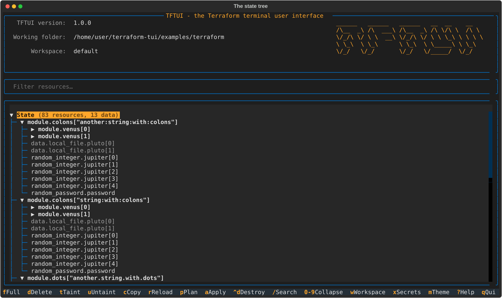
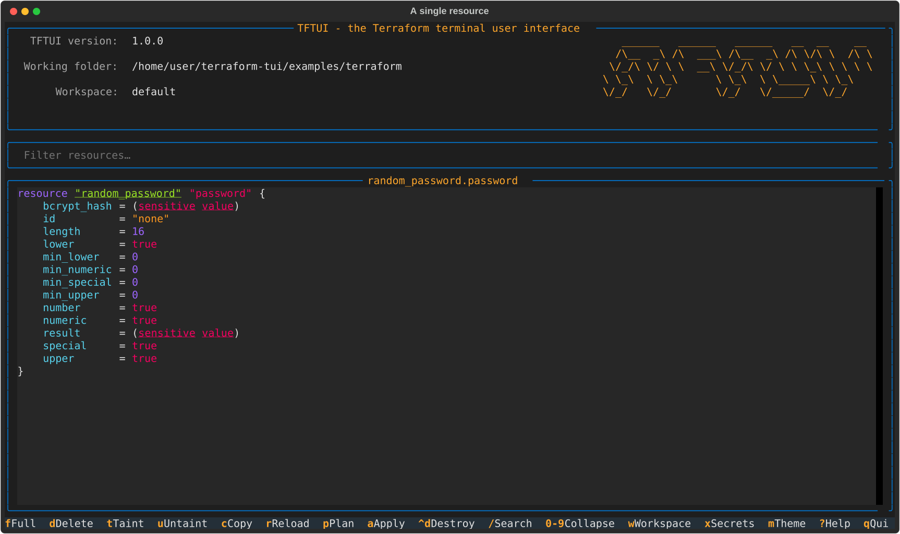
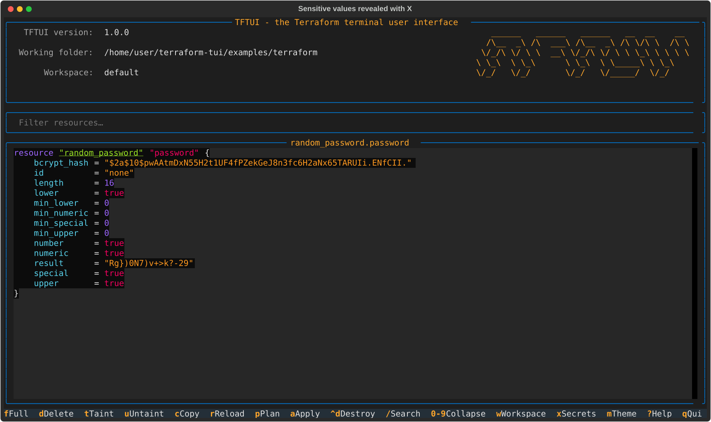
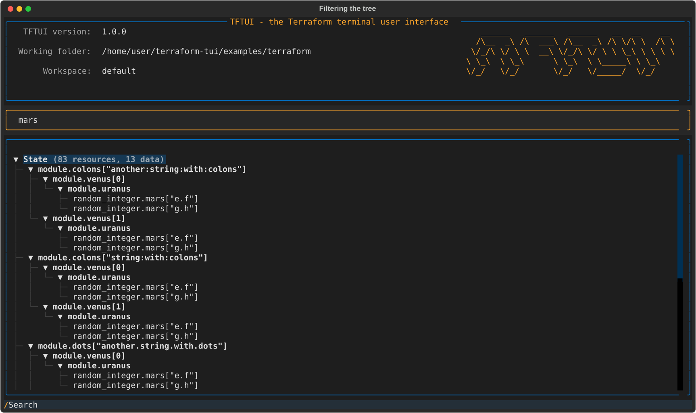
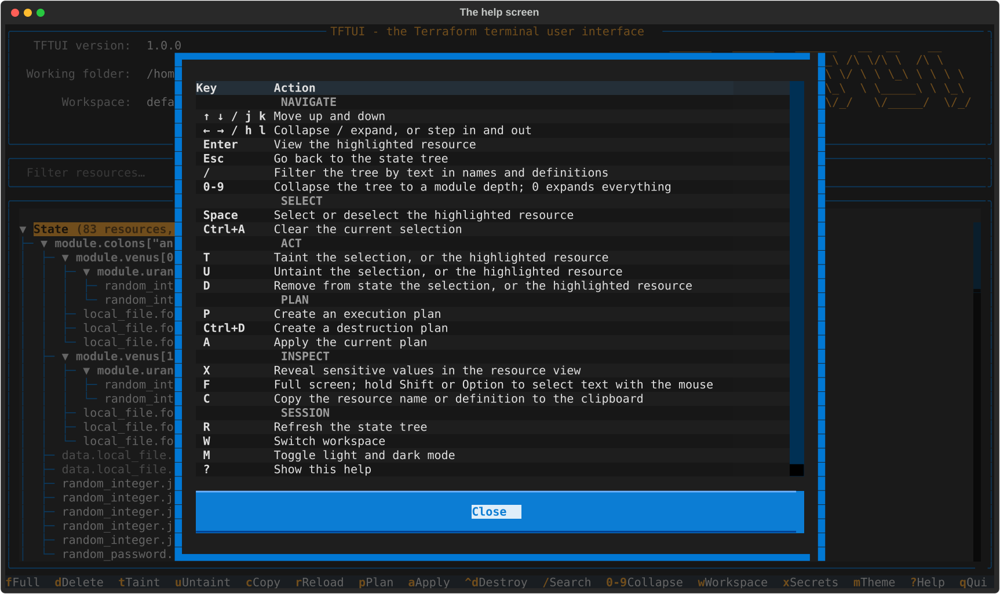
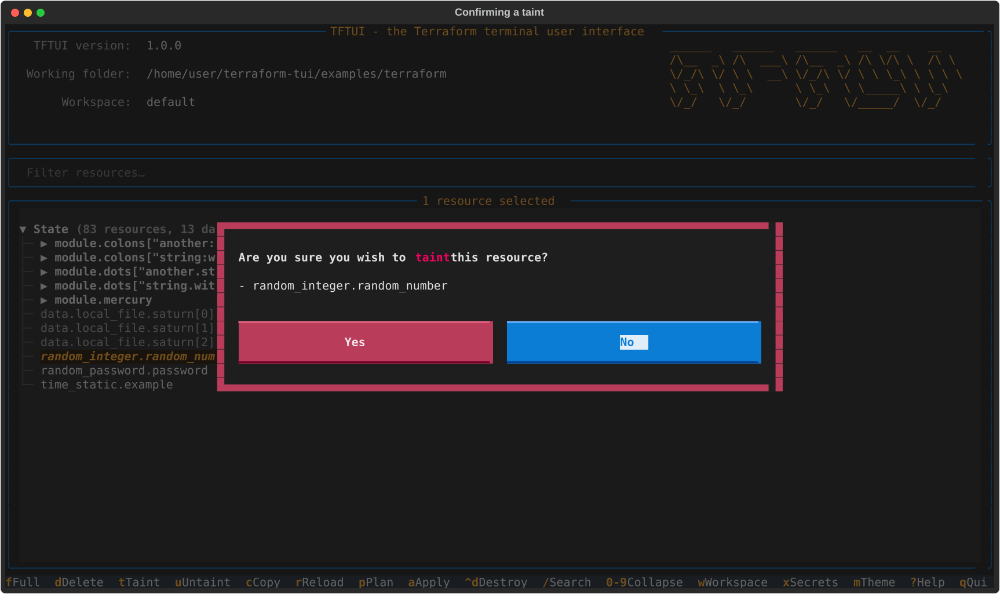
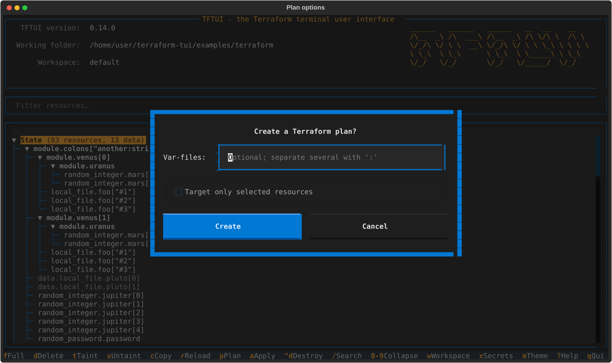
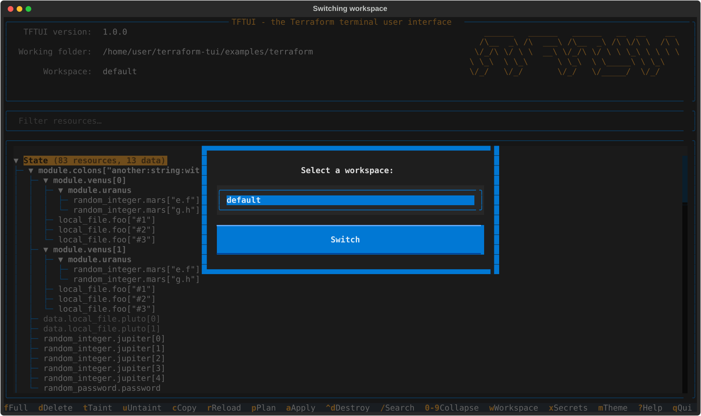

# Screenshots

Every image here is a real render of the application, captured headlessly
against the bundled example project by `scripts/capture-screenshots.py`.
Regenerate them with `make screenshots`.

## The state tree

Modules nest as they do in your configuration. Data sources are dimmed, tainted
resources are struck through, and the root shows what the state contains.



## A single resource

Rendered with HCL syntax highlighting.



## Revealing sensitive values

Sensitive attributes stay redacted until you press `X`, and are then matched to
their attributes by name.



## Filtering

`/` filters on text in resource names *and* their definitions. Modules with no
surviving children are pruned.



## Help



## Acting on resources

Select with `Space`, then taint, untaint or remove from state. The confirmation
defaults to *No*.



## Planning




## Workspaces



---

## Re-recording the animated demo

`demo/tftui.gif` predates 1.0 and shows the old interface. To replace it,
record with [asciinema](https://asciinema.org) and convert with
[agg](https://github.com/asciinema/agg):

```bash
make example-apply
cd examples/terraform
asciinema rec ../../demo/tftui.cast -c "tftui --offline --no-init"
agg ../../demo/tftui.cast ../../demo/tftui.gif
```
